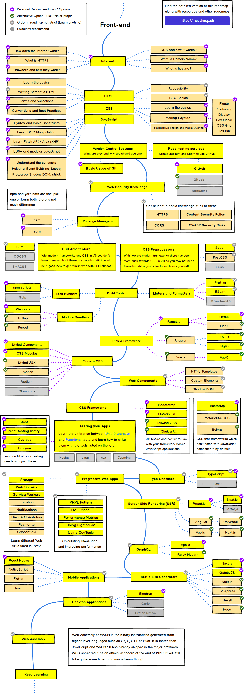

# Front-End Development Roadmap

## Internet (*optional*)

- DNS
- Host
- HTTP
- Handshaking

## HTML

- Basic
- SEO
- Form

## CSS

  ### CSS Preprocessor

  - Sass
  - PostCss (*optional*)

  ### CSS architecture

  - BEM
  - OOCSS (*optional*)
  - SMACSS (*optional*)
  
  ### modern CSS (*optional*)

  - CSS in Js (Styled component and styled JSX)
  - CSS Modules

  ### CSS Frameworks (*optional*)

  - [Tailwind](https://tailwindcss.com/)
  - [Material UI](https://mui.com/)
  - [Element UI](https://element.eleme.io/)
  - [Chakra UI](https://chakra-ui.com/)
  - [Radix UI](https://www.radix-ui.com/)

    ### Resources
    - [MDN](https://medium.com/emit-stories/frontend-developer-roadmap-2021-ff89e4bea685#:~:text=CSS-,MDN,-CSS%20for%20JavaScript)
    - [CSS for JavaScript Developers](https://medium.com/emit-stories/frontend-developer-roadmap-2021-ff89e4bea685#:~:text=MDN-,CSS%20for%20JavaScript%20Developers,-is%20an%20online)
    - [CSS Trick](https://medium.com/emit-stories/frontend-developer-roadmap-2021-ff89e4bea685#:~:text=CSS.%20Highly%20recommend.-,CSS%2DTricks,-and%20Smashing%20Magazine)
    - [Smashing magazine](https://www.smashingmagazine.com/)

## JavaScript
- [javascript roadmap](javascript.md)

  ### Resources
  - [MDN](https://developer.mozilla.org/en-US/docs/Web/JavaScript)
  - [You Don't Know JS](https://github.com/getify/You-Dont-Know-JS)
  - [Eloquent Javascript](https://eloquentjavascript.net/)
  - [javascript.info](https://javascript.info/)

## SPA(Vue)
- [Vue roadmap](vue.md)

## SSR(Nuxt)

## SSG

## Web Performance

[smashing magazine](https://www.smashingmagazine.com/2021/01/front-end-performance-2021-free-pdf-checklist/)

## TypeScript (*optional*)
  ### Resources
  - [typescriptlang.org](https://www.typescriptlang.org/)
  - [tutorialspoint.com](https://www.tutorialspoint.com/typescript/index.htm)
  
## Git

- Basic
- Repo

## package managers (*optional*)

- NPM
- Yarn
  ### resource
  - [MDN](https://developer.mozilla.org/en-US/docs/Learn/Tools_and_testing/Understanding_client-side_tools/Package_management)

## Build Tools (*optional*)

- Task Runners: npm scripts
- Module Bundlers: webpack, esbuild, Vite, Parcell

## Linter and formatter (*optional*)

- Prettier
- ES Lint

## Test framwork (*optional*)
- unit testing
- integration testing
- end to end testing
- performance testing
- ...
- [confluence docs](https://docs.basalam.dev/pages/viewpage.action?pageId=20416153)

## Data Logs (*optional*)
- google analytics
- google tag managers
- webengage
- ...

## PWA (*optional*)
- workbox
- manifest
- pwa configs
- access

  ### resource
  - [Web.dev](https://medium.com/emit-stories/frontend-developer-roadmap-2021-ff89e4bea685#:~:text=Progressive%20Web%20Apps-,web.dev,-MDN)
  - [MDN](https://medium.com/emit-stories/frontend-developer-roadmap-2021-ff89e4bea685#:~:text=web.dev-,MDN,-Web%20Components)

## HTTP Request

- [axios](https://github.com/axios/axios)
- [ky](https://github.com/sindresorhus/ky)
- [got](https://github.com/sindresorhus/got)
- [superagent](https://github.com/visionmedia/superagent)
  ### Resources:
  - [compare](https://github.com/sindresorhus/got)
  - [trends](https://www.npmtrends.com/axios-vs-got-vs-ky-vs-superagent)

## Clean code
  - [Writing Clean Code in JavaScript](https://blog.bitsrc.io/writing-clean-code-in-javascript-dd584bbe1874)
## Web components
- Shadow Dom
  ### Resources:
  - [MDN](https://developer.mozilla.org/en-US/docs/Web/Web_Components)
  - [WEBCOMPONENTS.ORG](https://www.webcomponents.org/)

## Web Security
- HTTPS [^1]
- CORS [^2]
- Content Security Policy [^3]
- Session/Cookie [^4]
- AuthN/AuthZ [^5]
- Secret Key Management [^6]
- OWASP Security Risks [^7]
  ### Resources :
  - [MDN](https://developer.mozilla.org/en-US/docs/Learn/Server-side/First_steps/Website_security)
  - [Martin Fowler: The Basics of Web Application Security ](https://martinfowler.com/articles/web-security-basics.html)

---

## Resources
- https://roadmap.sh/frontend
- https://frontendmasters.com/guides/learning-roadmap/
- https://www.decipherzone.com/blog-detail/front-end-developer-roadmap-2021
- https://medium.com/emit-stories/frontend-developer-roadmap-2021-ff89e4bea685
- https://javascript.works-hub.com/learn/front-end-development-roadmap-b08ed
- https://vitto.cc/the-complete-front-end-developer-roadmap-2021/
- https://digitalya.co/blog/the-frontend-roadmap/

## course
- https://www.udemy.com/course/the-complete-junior-to-senior-web-developer-roadmap/

## junior to senior
- https://distantjob.com/blog/junior-front-end-developer-skills/
- https://medium.com/zerotomastery/dont-be-a-junior-developer-the-roadmap-9fde5cf384bb
- https://javascript.plainenglish.io/a-practical-guide-to-become-a-senior-frontend-developer-553ec50e2933
- https://www.cleverism.com/job-profiles/senior-frontend-developer/
- https://betterprogramming.pub/the-differences-between-a-junior-mid-level-and-senior-developer-bb2cb2eb000d 

[^1]: HTTPS (HyperText Transfer Protocol Secure) is an encrypted version of the HTTP protocol. It uses SSL or TLS to encrypt all communication between a client and a server. This secure connection allows clients to safely exchange sensitive data with a server.
[^2]: Cross-Origin Resource Sharing (CORS) is an HTTP-header based mechanism that allows a server to indicate any other origins (domain, scheme, or port) than its own from which a browser should permit loading of resources.
[^3]: Content Security Policy (CSP) is an added layer of security that helps to detect and mitigate certain types of attacks, including Cross Site Scripting (XSS) and data injection attacks.
[^4]: An HTTP cookie (web cookie, browser cookie) is a small piece of data that a server sends to the user’s web browser. The browser may store it and send it back with later requests to the same server. It is used primarily for session management.
[^5]: Authentication is the process of verifying who a user is, while authorization is the process of verifying what they have access to.
[^6]: Secrets management refers to the tools and methods for managing digital authentication credentials (secrets), e.g. passwords, keys, APIs, and tokens.
[^7]: The Open Web Application Security Project® (OWASP) is a non-profit organization that is proficient in the field of web application security. It provides the list of critical security concerns for web application security.

## Image

